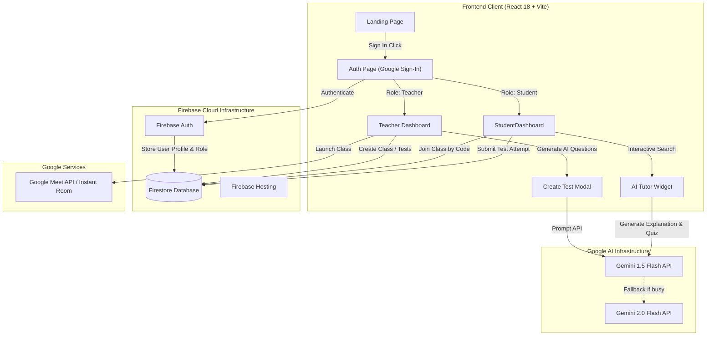

# 🎓 EduAI - Intelligent Adaptive Learning & Assessment Platform

[](https://eduai-d168d.web.app)
[](https://console.firebase.google.com/project/eduai-d168d)
[](https://aistudio.google.com)

**EduAI** is a real-time, AI-powered adaptive learning platform designed for teachers and students. It features Google Firebase Auth, Firestore real-time sync, Google Gemini 1.5 & 2.0 Flash models for AI tutoring & automated question generation, Google Meet integration, and detailed student analytics.

---

## 🏗️ Whole App Directory Structure

```
iem_hacks/
├── README.md                          # Application documentation & pipeline architecture
└── frontend/                          # Vite + React 18 Single Page Application
    ├── firebase.json                  # Firebase Hosting SPA routing & rewrite rules
    ├── firestore.rules                # Production Firestore Security Rules
    ├── firestore.indexes.json         # Firestore Composite Indexes
    ├── index.html                     # HTML5 entrypoint & Google Fonts (League Spartan)
    ├── package.json                   # Dependencies (Firebase, Lucide-React, Recharts)
    ├── vite.config.js                 # Vite build configuration (Port 3000)
    ├── .env                           # Environment secrets (Firebase & Gemini keys)
    ├── .env.example                   # Environment configuration template
    └── src/
        ├── main.jsx                   # React DOM root entrypoint
        ├── App.jsx                    # Core Router & Navigation controller
        ├── firebase.js                # Firebase App, Auth & Firestore initialization
        ├── index.css                  # Physical Kiss-Cut Material Design CSS system
        ├── context/
        │   └── AuthContext.jsx        # Auth state context provider & role switcher
        ├── components/
        │   ├── Navbar.jsx             # Role-aware Navigation Bar with user badge
        │   ├── EmptyState.jsx         # Component for empty classes/tests/attempts
        │   ├── AITutor.jsx            # Gemini AI explanation & practice quiz widget
        │   ├── CreateTestModal.jsx    # Teacher test creator with AI question generator
        │   └── ConductClassModal.jsx # Teacher Google Meet instant room launcher
        └── pages/
            ├── LandingPage.jsx        # Public product showcase landing page
            ├── AuthPage.jsx           # Google Sign-In & Role selection (Student/Teacher)
            ├── TeacherDashboard.jsx   # Class management, AI Test builder, Meet & Analytics
            └── StudentDashboard.jsx   # Class enrolment, Test attempt view, AI Tutor & Progress
```

---

## ⚡ Complete System Pipeline & Architecture

### 1. High-Level Data & AI Pipeline



---

### 2. Teacher & Student Workflow Pipelines

#### 👨‍🏫 Teacher Workflow Pipeline
```
[Google Sign-In] ➔ [Select Teacher Role] ➔ [Create Class & Get Code] 
        │
        ├──► [Conduct Instant Class] ➔ [Launch Google Meet]
        ├──► [Create Test] ➔ [Prompt Gemini AI for Questions] ➔ [Publish Test to Class]
        └──► [View Class Analytics] ➔ [Real-Time Student Attempt Scores & Progress]
```

#### 👨‍🎓 Student Workflow Pipeline
```
[Google Sign-In] ➔ [Select Student Role] ➔ [Enter Class Code] 
        │
        ├──► [Take Test] ➔ [Submit Answers] ➔ [Auto-Score & Save to Firestore]
        ├──► [AI Tutor] ➔ [Search Any Topic] ➔ [Receive Gemini 1.5 Flash Explanation & Quiz]
        └──► [Progress Dashboard] ➔ [Track Average Score & Attempt History]
```

---

## 🗄️ Firestore Database Schema

```
collections/
├── users/
│   └── {uid} ➔ { uid, email, displayName, photoURL, role: "teacher"|"student", createdAt }
├── classes/
│   └── {classId} ➔ { className, subject, joinCode, teacherId, teacherName, studentIds: [], createdAt }
├── tests/
│   └── {testId} ➔ { title, subject, classId, teacherId, questions: [{ text, options, correctAnswer, difficulty }], createdAt }
└── attempts/
    └── {attemptId} ➔ { testId, testTitle, classId, studentId, studentName, score, totalQuestions, percentage, answers: [], completedAt }
```

---

## 🚀 Environment Setup & Deployment

### 1. Prerequisites
- Node.js `v18+`
- Firebase CLI (`npm install -g firebase-tools`)
- Google Gemini API Key from [Google AI Studio](https://aistudio.google.com/app/apikey)

### 2. Local Environment Setup
1. Copy `.env.example` to `frontend/.env`:
   ```bash
   cp frontend/.env.example frontend/.env
   ```
2. Populate `frontend/.env` with your credentials:
   ```env
   VITE_FIREBASE_API_KEY="YOUR_FIREBASE_API_KEY"
   VITE_FIREBASE_AUTH_DOMAIN="eduai-d168d.firebaseapp.com"
   VITE_FIREBASE_PROJECT_ID="eduai-d168d"
   VITE_FIREBASE_STORAGE_BUCKET="eduai-d168d.firebasestorage.app"
   VITE_FIREBASE_MESSAGING_SENDER_ID="506743743156"
   VITE_FIREBASE_APP_ID="1:506743743156:web:440788f645a8255f8f3f1b"
   VITE_GEMINI_API_KEY="YOUR_GEMINI_API_KEY"
   ```

### 3. Running Locally
```bash
cd frontend
npm install
npm run dev
```
Open `http://localhost:3000` in your browser.

### 4. Deploying to Firebase Hosting
```bash
cd frontend
npm run build
firebase deploy --only hosting,firestore
```

---

## 🎨 Design System
- **Ground Color**: `#f3c9d5` (Blush Pink)
- **Ink Color**: `#1A2540` (Deep Navy)
- **Accent Color**: `#cc2b3f` (Crimson)
- **Card Surface**: `#f2e9db` (Cream)
- **Icons**: Lucide-React (`<Bot />`, `<GraduationCap />`, `<TrendingUp />`, etc.)
